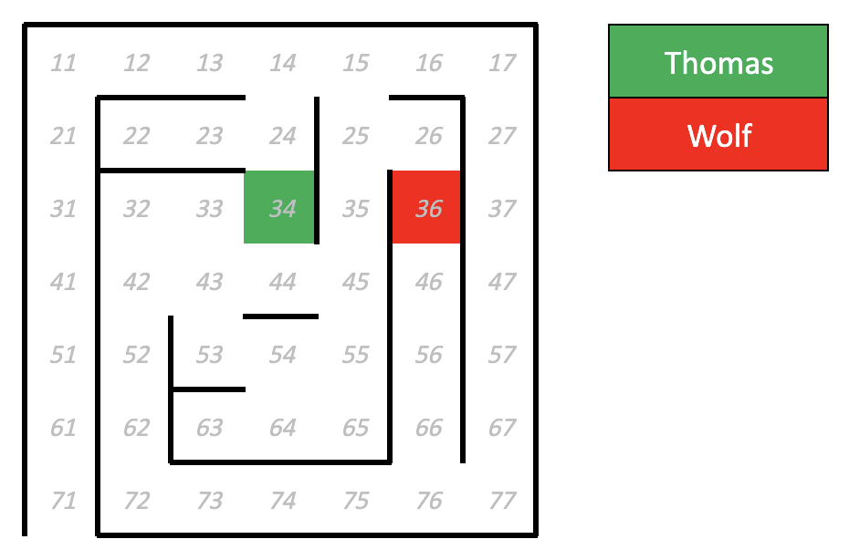
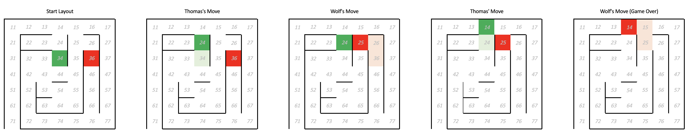
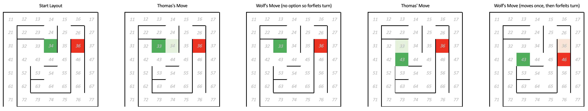

# Requirement
You are provided with an incomplete implementation of the puzzle logic below.  Complete the solution by adding the following:
1. Implement the `getExits` function in [puzzle.js](./src/logic/puzzle.js)
2. Implement logic to make Thomas move (e.g. pick a random direction) and also to check whether he has escaped the puzzle within the `runGame` function in [puzzle.js](./src/logic/puzzle.js)
3. Implement the wolf's move logic as detailed below in [wolf.js](./src/behaviour/wolf.js)
4. Implement moving the wolf and also check whether he has caught Thomas within the `runGame` function in [puzzle.js](./src/logic/puzzle.js)
5. Implement a way of writing to the console information about the attempted solution within the `runSolution` function in [solution.js](./src/logic/solution.js)
6. Write unit tests for the files in the behaviour folder - in particular test the wolf's movements match with the logic detailed below

# Thomas and the Wolf

You are provided with a grid (example above is 7x7 but it could be any size).  Thomas needs to escape the grid without the wolf eating him.  This is a turn-based puzzle, Thomas takes a turn, then the wolf takes a turn, and so on.  You control Thomas' movement; the wolf's movements are automatic (see below sub-points for wolf rules).

- The grid contains walls - neither Thomas, nor the wolf can pass through walls
- Thomas can move one space or can chose not to move for his turn
- The wolf can move up to two spaces towards Thomas
    - If the wolf and Thomas are on the same row, the wolf will only try to move horizontally towards Thomas
    - If the wolf and Thomas are on the same column, the wolf will only try to move vertically towards Thomas
    - If the wolf and Thomas are on different rows and columns, the wolf will move in whichever direction isn't blocked and moves it closer to Thomas (the wolf favours vertical over horizontal if both paths are open)
    - If the wolf cannot move in any direction towards Thomas (e.g. due to walls), it will forfeit its turn and remain stationary
- The game is won if Thomas escapes the grid (i.e. by reaching 71 in the example above)
- The game is lost if the wolf reaches Thomas during its turn

## Examples (using the layout pictured above)
- If Thomas moves from 34 to 33 on his turn, the wolf is on the same row as Thomas so only tries to move horizontally towards him.  However, as there is a wall in the way, the wolf can't move so forfeits its turn
- If Thomas moves from 34 to 24 on his turn, the wolf is on a different row and column to Thomas so tries to move whichever way it can towards Thomas.  The wolf will move to 26 first and then to 25 during it's turn (it can't move to 35 and then to 25 as there is a wall between 35 and 36)
- If Thomas moves from 34 to 44, the wolf is on a different row and column to Thomas so tries to move whichever way it can towards Thomas.  The wolf cannot move horizontally through the wall to 35, so instead follows Thomas on the vertical axis to 46.  The wolf then is on the same row as Thomas so tries to move horizontally towards him but can't as there is a wall between 45 and 46, so forfeits its remaining move in his turn.

### Example game 1
1. Thomas moves up one
2. Wolf moves up one, then left one
3. Thomas moves up one
4. Wolf moves up one, then left one
5. Wolf eats Thomas, game over

### Example game 2
1. Thomas moves left one
2. Wolf forfeits turn
3. Thomas moves down one
4. Wolf moves down one and then forfeits second move in turn
5. And so on…

